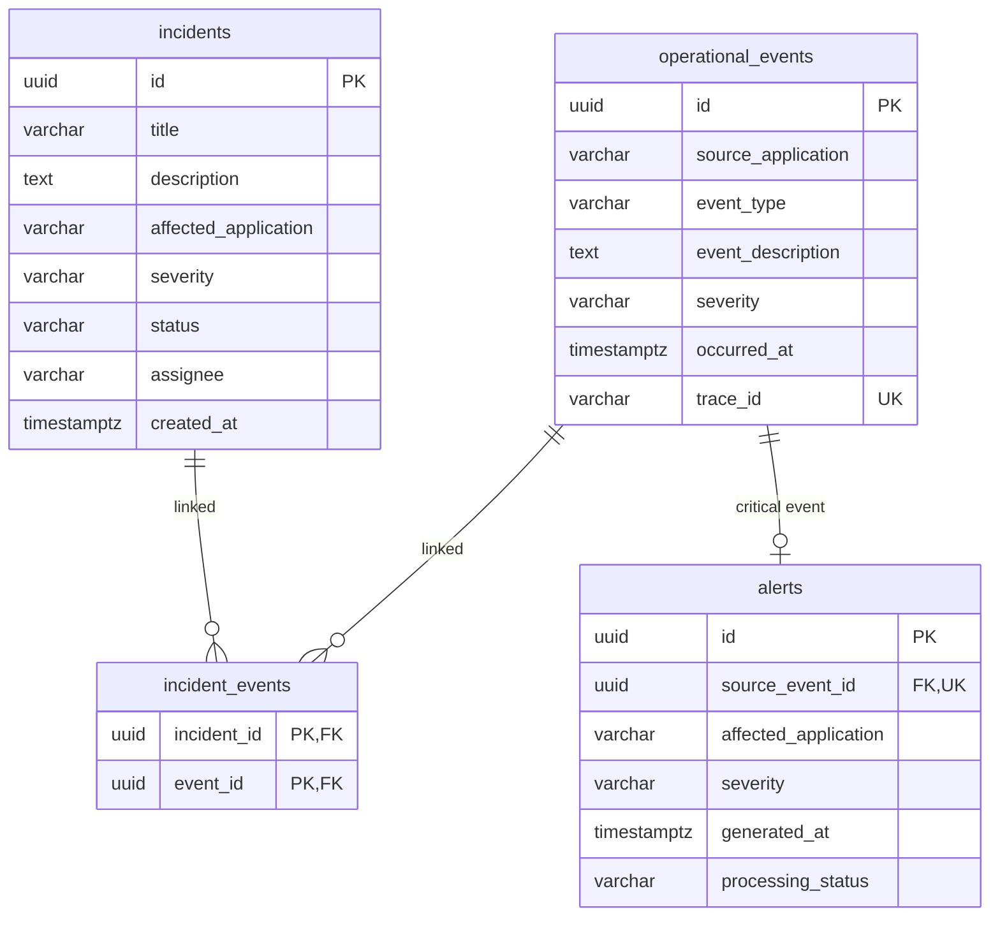

# Reto Técnico: Plataforma de Gestión de Incidentes y Monitoreo Operacional — Backend

**Desarrollado por:** Johan Higuita

API REST para registro de eventos (HU1), gestión de incidentes (HU2), alertas (HU3), métricas de dashboard (HU4) e integración legacy PHP (HU5).

---

## Stack tecnológico

| Área | Tecnología |
|------|------------|
| Runtime | Node.js 20+, TypeScript (ESM) |
| HTTP | Express 5 |
| Base de datos | PostgreSQL 16 (`pg`, SQL manual) |
| Arquitectura | DDD, capas hexagonales, monolito modular |
| Documentación | OpenAPI 3 + Swagger UI |
| Legacy | PHP 8 (`legacy/`) |
| Tests | Vitest |
| Dev | tsx, nodemon, Docker Compose |
| Agente AI | Cursor (asistente de desarrollo y revisión) |

---

## Requisitos

- Node.js 20+
- Docker Desktop (PostgreSQL local)
- PHP 8+ (solo para probar el cliente legacy HU5)

---

## Cómo iniciar la app

```bash
# 1. Base de datos (desde la raíz del monorepo)
docker compose up -d

# 2. Backend
cd backend
cp .env.example .env          # Windows: Copy-Item .env.example .env
npm install
npm run dev
```

- API: **http://localhost:3000**
- Swagger: **http://localhost:3000/api-docs**
- Health: `GET /health`

| Variable | Descripción |
|----------|-------------|
| `DATABASE_URL` | Conexión PostgreSQL (debe coincidir con `docker-compose.yml`) |
| `PORT` | Puerto HTTP (default `3000`) |

---

## Datos de prueba (`npm run populate`)

Script en `scripts/populate.ts` que **sembrar la BD solo vía HTTP** (no escribe directo en PostgreSQL). Requiere la API en marcha.

```bash
# Terminal 1
npm run dev

# Terminal 2 (desde backend/)
npm run migrate    # solo si faltan tablas (volumen Docker antiguo)
npm run populate
```

Si falla por tabla `alerts` inexistente, ejecutar `npm run migrate` primero.

---

## Integración legacy (HU5)

Cliente PHP en `legacy/` que consulta incidentes abiertos desde la API moderna.

```
PHP (legacy/)  --GET /api/v1/incidents/open-->  API Express  -->  PostgreSQL
```

| Archivo | Rol |
|---------|-----|
| `legacy/OpenIncidentsClient.php` | Cliente HTTP reutilizable |
| `legacy/list_open_incidents.php` | Punto de entrada (CLI o web) |

**Requisitos:** PHP 8+, extensión `curl` o `allow_url_fopen`, API en marcha.

```bash
# Desde backend/
php legacy/list_open_incidents.php
```

Salida JSON: `id`, `affectedApplication`, `severity`, `status`, `createdAt` (estados `OPEN` e `IN_PROGRESS`).

Demo web: `php -S localhost:8080 legacy/list_open_incidents.php`

---

## Tests

```bash
npm test              # ejecución única
npm run test:watch    # modo watch
```

**Qué se prueba (27 tests unitarios):**

| Área | Cobertura |
|------|-----------|
| `operational-events` | VOs (`Severity`, `SourceApplication`), agregado, `RegisterOperationalEventUseCase` |
| `incidents` | Transiciones de `IncidentStatus`, crear/actualizar/listar abiertos |
| `alerts` | Handler CRITICAL → alerta |
| `dashboard` | Filtros, buckets de estados, `GetDashboardMetricsUseCase` |
| `shared` | `InMemoryEventBus` |

No hay tests de integración con PostgreSQL; los repositorios se validan en runtime.

---

## DDD — lenguaje ubicuo

### Bounded contexts

| Contexto | Agregado raíz | Responsabilidad |
|----------|---------------|-----------------|
| `operational-events` | `OperationalEvent` | Registro inmutable de eventos operacionales |
| `incidents` | `Incident` | Ciclo de vida del incidente (estado mutable) |
| `alerts` | `Alert` | Alerta operacional por evento CRITICAL |
| `dashboard` | — (lectura) | Métricas agregadas para el dashboard |

Integración entre contextos **solo por IDs** (`UniqueEntityId`), sin acoplar agregados.

### Capas por contexto

```
domain/          → agregados, VOs, puertos (sin Express ni pg)
application/     → casos de uso, DTOs, errores de aplicación
infrastructure/  → HTTP, persistencia PostgreSQL
```

Composition root en `*Routes.ts` (ensambla repositorio → use case → controller).

---

## Diagrama E-R (PostgreSQL)



---

## Deuda técnica

- **Manejo de errores HTTP** — la lógica vive en cada controller (`try/catch`); el `errorHandler` global existe pero casi no se usa porque los errores no se propagan con `next(err)`. Hubiera gustado un mapeo centralizado dominio → status (400/404/409/500).
- **Caché con Redis** — las métricas del dashboard y consultas frecuentes golpean PostgreSQL directo; Redis hubiera reducido carga y latencia.
- **ORM** — persistencia con SQL manual y `pg`; un ORM (p. ej. Prisma, Drizzle) hubiera acelerado consultas repetitivas y migraciones, a costa de más acoplamiento con el modelo relacional.
- **WebSockets** — descartados; el frontend usa polling para actualizar el dashboard.
- **Tests de integración** — solo unitarios con mocks; sin suite contra PostgreSQL real.
